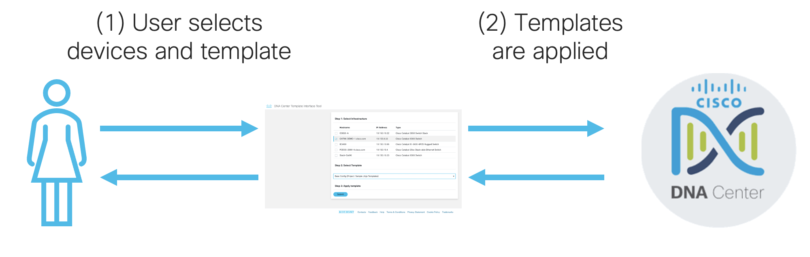
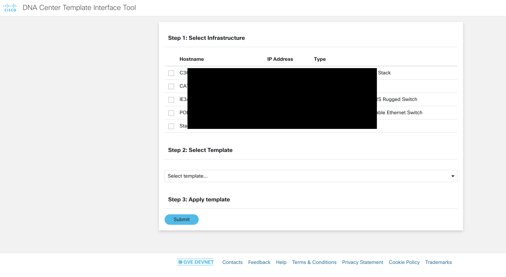
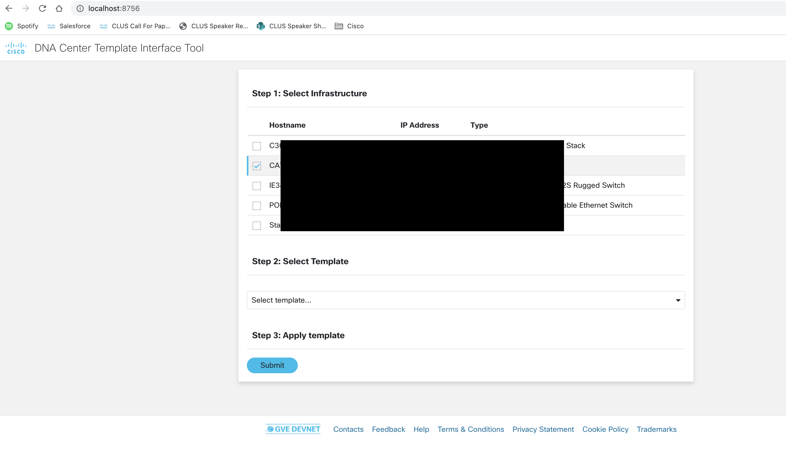
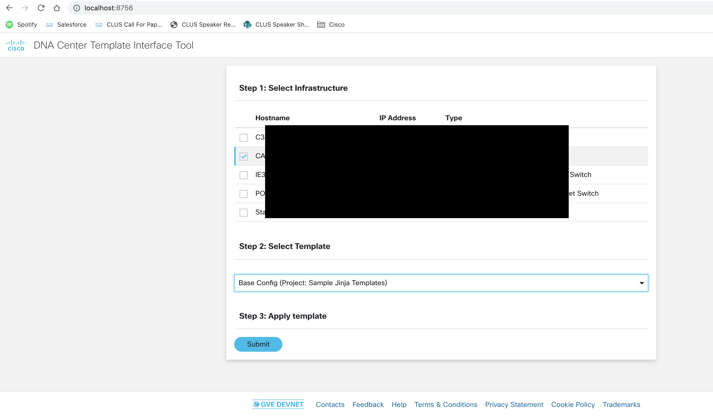

# GVE DevNet DNA Center Interface Tool
This prototype facilitates easy interaction with DNA Center templates. The user first selects the devices they want to configure, then the templates they want to apply, and finally submit their choices. The tool then interacts with DNA Center over its REST APIs to deploy the chosen templates to their corresponding infrastructure.

## Contacts
* Stien Vanderhallen (stienvan@cisco.com)

## High-level Overview



## Solution Components
* Flask
* Python
* DNA Center

## Installation

Execute the below commands in your terminal. 

1.	Choose a folder, then create and activate a virtual environment for the project
    ```python
    # WINDOWS:
    $ py -3 -m venv [add name of virtual environment here] 
    source [add name of virtual environment here]/Scripts/activate
    # MAC:
    $ python3 -m venv [add name of virtual environment here] 
    $ source [add name of virtual environment here]/bin/activate
    ```

2. Access the created virtual enviroment folder
    ```
    $ cd [add name of virtual environment here] 
    ```

3.	Clone this Github repository into the virtual environment folder.
    ```
    $ git clone wwww.github.com/gve-sw/gve_devnet_dnac_template_interface
    ```

4. Access the folder **gve_devnet_dnac_template_interface**
    ```
    $ cd gve_devnet_dnac_template_interface
    ```

5.	Install dependencies
    ```python
    $ pip3 install -r requirements.txt
    ```

6. In `.env`, fill in the following details:
- `DNAC_HOST`: The IP address of your DNAC instance
- `DNAC_USER`: The username for your DNAC instance
- `DNAC_PASS`: The password for your DNAC instance

7. Run the application
    ```
    $ python3 app.py
    ```
8. In a browser, navigate to `localhost:8756`

## Workflow

0. The landing page of the prototype



1. Select the devices you want to configure



2. Select the template you want to apply to those devices



3. Click `Submit`


### LICENSE

Provided under Cisco Sample Code License, for details see [LICENSE](LICENSE.md)

### CODE_OF_CONDUCT

Our code of conduct is available [here](CODE_OF_CONDUCT.md)

### CONTRIBUTING

See our contributing guidelines [here](CONTRIBUTING.md)

#### DISCLAIMER:
<b>Please note:</b> This script is meant for demo purposes only. All tools/ scripts in this repo are released for use "AS IS" without any warranties of any kind, including, but not limited to their installation, use, or performance. Any use of these scripts and tools is at your own risk. There is no guarantee that they have been through thorough testing in a comparable environment and we are not responsible for any damage or data loss incurred with their use.
You are responsible for reviewing and testing any scripts you run thoroughly before use in any non-testing environment.
